# Development Setup & Tooling Guide

This document explains the comprehensive linting, formatting, and development setup for this monorepo template.

## 🎯 Overview

This template uses a **multi-tool approach** where different specialized tools handle different file types, ensuring optimal performance and the best possible developer experience for each language and file format.

## 🛠️ Tool Responsibilities

### Primary Tools

| Tool | File Types | Purpose | Configuration |
|------|------------|---------|---------------|
| **Biome (via Ultracite)** | `.js`, `.ts`, `.jsx`, `.tsx`, `.json`, `.jsonc` | Fast linting & formatting for JavaScript/TypeScript | `biome.jsonc` |
| **Prettier** | `.yaml`, `.yml`, `.css`, `.scss`, `.less` | Opinionated formatting for config & style files | `.prettierrc.json` |
| **MarkdownLint** | `.md`, `.mdx`, `.mdc` | Markdown validation & auto-fixing | `.markdownlint-cli2.jsonc` |
| **Stylelint** | `.css`, `.scss`, `.less` | CSS linting with Tailwind support | `.stylelintrc.json` |

### Supporting Tools

- **Lefthook**: Git hooks for pre-commit and pre-push validation
- **Turbo**: Monorepo task orchestration and caching
- **TypeScript**: Type checking across the workspace
- **Vitest**: Testing framework with coverage

## 🔄 Tool Coordination Flow

```mermaid
graph TD
    A[File Save/Commit] --> B{File Type Detection}
    
    B -->|.js,.ts,.jsx,.tsx,.json| C[Biome via Ultracite]
    B -->|.yaml,.yml,.css,.scss| D[Prettier]
    B -->|.md,.mdx,.mdc| E[MarkdownLint]
    B -->|.css,.scss,.less| F[Stylelint]
    
    C --> G[Format & Lint JS/TS]
    D --> H[Format Config Files]
    E --> I[Validate Markdown]
    F --> J[Lint CSS]
    
    G --> K[Pre-commit Hook]
    H --> K
    I --> K
    J --> K
    
    K --> L{All Tools Pass?}
    L -->|Yes| M[✅ Commit Succeeds]
    L -->|No| N[❌ Block Commit]
```



## 📋 Available Scripts

### Core Commands

```bash
# Format all files (auto-fix where possible)
bun run format

# Check formatting without fixing
bun run format:check

# Full linting (validation only)
bun run lint  

# Auto-fix all linting issues
bun run lint:fix
```

### Tool-Specific Commands

```bash
# Markdown only
bun run lint:md          # Check markdown
bun run lint:md:fix      # Fix markdown

# CSS only  
bun run lint:css         # Check CSS
bun run lint:css:fix     # Fix CSS

# Biome only
bun x ultracite@latest lint    # Check JS/TS
bun x ultracite@latest format  # Fix JS/TS
```

### Build & Test

```bash
# Development
bun run dev              # Start all workspace dev servers

# Production builds
bun run build           # Build all packages/apps
bun run typecheck       # Type check everything

# Testing
bun run test            # Run tests with watch mode
bun run test:ci         # Run tests once for CI

# Full CI pipeline
bun run ci:full         # lint + typecheck + test + build
```

## 🔧 VS Code Integration

### Recommended Extensions

- **Biome**: `biomejs.biome` - JavaScript/TypeScript formatting & linting
- **Prettier**: `esbenp.prettier-vscode` - YAML/CSS formatting  
- **Stylelint**: `stylelint.vscode-stylelint` - CSS linting
- **MarkdownLint**: `DavidAnson.vscode-markdownlint` - Markdown validation

### Auto-Formatting Configuration

The workspace is configured for **format-on-save** with tool assignment:


### File Nesting

Config files are automatically nested under `package.json` in the explorer:

- `.markdownlint-cli2.jsonc`
- `.prettierrc.json`
- `.stylelintrc.json`
- `biome.jsonc`
- `lefthook.yml`
- `turbo.json`
- Lock files (`.lock`, `.lockb`)

## ⚙️ Configuration Details

### Biome (via Ultracite)

- **Purpose**: Zero-config TypeScript/JavaScript tooling
- **Speed**: Extremely fast (written in Rust)
- **Features**: Formatting, linting, import organization
- **Excludes**: Files handled by other tools (markdown, CSS, YAML)

**Key settings:**

```jsonc
{
  "extends": ["ultracite"],
  "javascript": {
    "globals": ["Bun"]  // Bun runtime support
  }
}
```

### Prettier

- **Purpose**: Opinionated code formatting
- **Philosophy**: Stop bikeshedding, focus on code
- **Config**: 100-char line width, single quotes, trailing commas

**Key settings:**

```json
{
  "printWidth": 100,
  "singleQuote": true,
  "trailingComma": "all"
}
```

### MarkdownLint

- **Purpose**: Markdown consistency and best practices  
- **Features**: Auto-fixing, multiple formats (`.md`, `.mdx`, `.mdc`)
- **Rules**: Customized for developer-friendly documentation

**Key rules:**

- `MD013: false` - No line length limits
- `MD040: false` - Code blocks don't require language
- `MD033: false` - Allow HTML in markdown

### Stylelint

- **Purpose**: CSS/SCSS validation and consistency
- **Config**: Standard rules + Tailwind CSS support
- **Features**: Auto-fixing, modern CSS support

**Tailwind integration:**

```json
{
  "ignoreAtRules": ["tailwind", "apply", "layer", "config"]
}
```

## 🔍 Git Hooks (Lefthook)

### Pre-commit Hook

Runs automatically before each commit:

1. **Format Check**: Biome validates JS/TS formatting
2. **Lint All**: All tools validate their respective files  
3. **Type Check**: Skip if no matching staged files

### Pre-push Hook

Runs before pushing to remote:

1. **Full Test Suite**: Runs all tests
2. **Build Verification**: Ensures production build succeeds

## 📁 EditorConfig Integration

Standardizes editor behavior across tools:

```ini
# JavaScript/TypeScript (Biome)
[*.{js,ts,tsx,json,jsonc}]
max_line_length = 100

# CSS (Prettier + Stylelint)  
[*.{css,scss,less}]
max_line_length = 80

# Markdown (MarkdownLint)
[*.{md,mdx,mdc}]
trim_trailing_whitespace = false
max_line_length = off
```

## 🚀 Performance Optimizations

### Caching Strategy

- **Turbo**: Caches build/test outputs across the monorepo
- **Biome**: Incremental checking of changed files only
- **Git Hooks**: Only process staged files

### Parallel Execution

- **Scripts**: Tools run in sequence to avoid conflicts
- **Turbo Tasks**: Parallelized across packages where safe
- **VS Code**: Extensions work independently per file type

## 🐳 Devcontainer Support

This template includes **full devcontainer support** for consistent development environments and faster web agent startup.

### Benefits for Web Agents

- **⚡ Faster Startup**: Pre-built container with all tools installed
- **🔄 Consistency**: Identical environment across different machines/agents  
- **🛡️ Isolation**: Clean, reproducible environment every time
- **🚀 Agent-Ready**: Bun, Node.js, and all linting tools pre-configured

### Container Architecture


### Quick Start

**VS Code:**

1. Install "Dev Containers" extension
2. Open template in VS Code
3. Click "Reopen in Container" when prompted
4. Wait for initial build (only happens once)

**Command Line:**

```bash
# Clone and start devcontainer
git clone <your-repo>
cd <your-repo>
devcontainer up --workspace-folder .
```

### Pre-installed Tools

The devcontainer comes with everything pre-configured:

| Tool | Version | Purpose |
|------|---------|---------|
| **Bun** | 1.1.44 | Runtime & package manager |
| **Node.js** | LTS | Compatibility & tools |
| **TypeScript** | Latest | Type checking |
| **Turbo** | Latest | Monorepo orchestration |
| **Biome** | Latest | JS/TS linting & formatting |
| **Prettier** | Latest | Code formatting |
| **MarkdownLint** | Latest | Markdown validation |
| **Stylelint** | Latest | CSS linting |

### Port Forwarding

Common development ports are automatically forwarded:

- **3000, 3001, 3002**: App servers
- **4173**: Vite preview
- **5173**: Vite dev server  
- **8080**: General development

### Development Aliases

The container includes convenient aliases:

```bash
# Quick commands
dev         # bun run dev
build       # bun run build  
test        # bun run test
lint        # bun run lint
format      # bun run lint:fix
typecheck   # bun run typecheck

# Git shortcuts
gs          # git status
ga          # git add
gc          # git commit
```

### Container Optimizations

- **Volume mounting**: `node_modules` cached for performance
- **User mapping**: Matches host UID/GID to avoid permission issues  
- **Shell setup**: Oh My Zsh with useful plugins
- **Extension sync**: All required VS Code extensions auto-installed

## 🛠️ Troubleshooting

### Common Issues

**❌ "No files matching pattern found" (Stylelint)**

```bash
# This is normal if no CSS files exist yet
# The script gracefully handles this case
```

**❌ Formatting conflicts between tools**

```bash
# Each tool handles different file types
# Check .vscode/settings.json for formatter assignment
```

**❌ Pre-commit hook fails**

```bash
# Run the failing command manually:
bun run lint:fix
git add .
git commit -m "your message"
```

### Debug Commands

```bash
# Check what files each tool processes
bun x ultracite@latest lint --dry-run
prettier --list-different "**/*.{yaml,yml}"
markdownlint-cli2 "**/*.{md,mdx,mdc}" --dry-run
stylelint "**/*.css" --formatter verbose
```

### Reset Configuration

```bash
# Reinstall dependencies
rm -rf node_modules bun.lock
bun install

# Reset git hooks  
bun run prepare
```

### Devcontainer Issues

**❌ Container won't start**

```bash
# Rebuild container completely
Dev Containers: Rebuild Container (VS Code Command Palette)
# Or via CLI:
devcontainer build --workspace-folder . --no-cache
```

**❌ Extensions not working**

```bash
# Reload window to refresh extensions
Developer: Reload Window (VS Code Command Palette)
```

**❌ Port forwarding not working**

```bash
# Check ports in VS Code terminal
bun run dev
# Manually forward port: Ports tab > Forward a Port
```

## 📚 Additional Resources

### Core Tools

- [Biome Documentation](https://biomejs.dev/)
- [Ultracite Guide](https://github.com/jcbhmr/ultracite)  
- [Prettier Configuration](https://prettier.io/docs/en/configuration.html)
- [MarkdownLint Rules](https://github.com/DavidAnson/markdownlint/blob/v0.38.0/doc/md040.md)
- [Stylelint Rules](https://stylelint.io/user-guide/rules/)
- [Lefthook Documentation](https://github.com/evilmartians/lefthook)

### Devcontainer Resources  

- [Dev Containers Documentation](https://containers.dev/)
- [VS Code Dev Containers](https://code.visualstudio.com/docs/devcontainers/containers)
- [devcontainer.json Reference](https://containers.dev/implementors/json_reference/)
- [Dockerfile Best Practices](https://docs.docker.com/develop/dev-best-practices/)

---

This setup ensures **consistent code quality**, **fast development cycles**, and **minimal configuration overhead** across your entire monorepo. Each tool excels at its specialized task while working harmoniously with the others.
